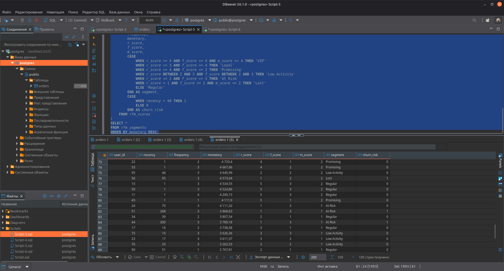
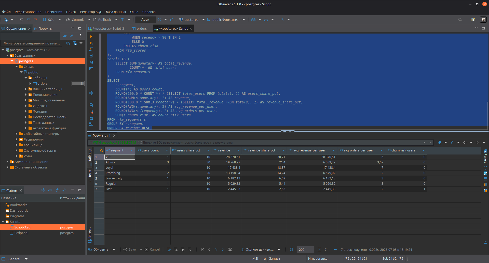

# customer_segmentation_rfm
SQL-проект по клиентской аналитике и сегментации на PostgreSQL.
В проекте рассчитаны метрики **Recency**, **Frequency** и **Monetary** на основе e-commerce датасета. Построены сегменты (VIP, Loyal, Promising, Regular, Low Activity, At Risk, Lost) и проанализирован их вклад в выручку и риск оттока.

## Стек
- PostgreSQL
- SQL
- DBeaver
- Ubuntu Linux

## Что внутри
- `data/` — исходные CSV-данные с заказами (100 пользователей, 367 заказов)
- `sql/` — SQL-запросы для расчёта RFM и сегментации
- `results/` — результаты запросов и скриншоты

## Метрики и сегменты
- Recency: сколько дней прошло с последней покупки пользователя
- Frequency: сколько заказов сделал пользователь
- Monetary: сколько денег принёс пользователь

На основе квантилей по R, F и M пользователи разбиваются на сегменты:
- VIP — самые ценные клиенты (часто покупают, тратят много, покупали недавно)
- Loyal — постоянные клиенты с устойчивой частотой покупок
- Promising — перспективные новые клиенты
- Regular — пользователи со средней активностью и выручкой
- Low Activity — низкоактивные пользователи
- At Risk — клиенты с риском оттока
- Lost — потерянные клиенты (давно не покупали)

Дополнительно - `churn_risk` — пользователи, которые не покупали более 90 дней.

## Результаты

### RFM-таблица по пользователям

- Таблица показывает RFM-профиль каждого пользователя: давность, частоту и денежный вклад.

### Сводка по сегментам

- VIP дают максимальную выручку при небольшой доле пользователей.

- Loyal — стабильные повторные покупатели с высокой частотой заказов и значимым вкладом в выручку.

- Promising — недавние клиенты с потенциалом роста в Loyal/VIP.

- At Risk и Lost — пользователи с высоким риском оттока, которых важно реактивировать.

- Low Activity и Regular — сегменты с низкой и средней активностью, в которых можно искать точки роста частоты и среднего чека.

## Улучшения

На основе сегментации можно:
- Сфокусировать программы лояльности и персональные предложения на сегментах VIP и Loyal.

- Запустить реактивационные кампании для сегментов At Risk и Lost (email, push, промокоды, персональные рекомендации).

- Улучшить коммуникации и стимулирующие механики для Low Activity и Regular, чтобы увеличивать частоту покупок и средний чек.

- Использовать сегменты в персонализации витрины: разные офферы для VIP, новых клиентов и пользователей с риском оттока.
